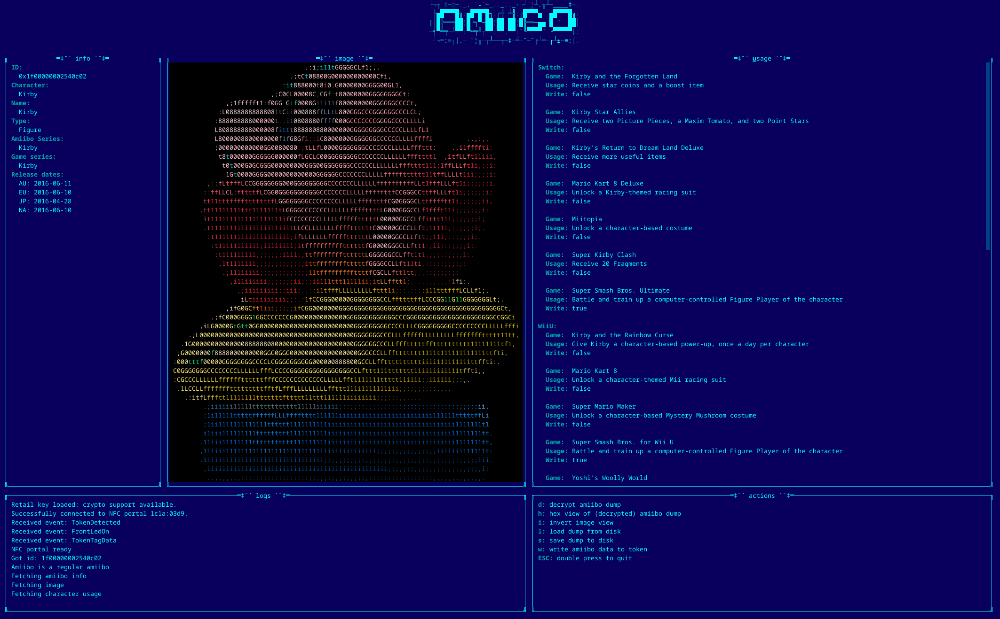

# Amiigo is the _uber geek amiibo inspector_


**Note**: the terminal interface still has lots of rendering issues, but is usable.

## Usage

### Building
Execute:
```shell
make clean; make amiigo
```
This will result in an `amiigo` binary in the root dir of this GIT repository.

### Running tests
Execute:
```shell
make test
```
**Note**: crypto tests will fail unless you supply the proper files, see the
[crypto_test.go](amiibo/crypto_test.go) file for details.

### Launch the CLI command
Example:
```shell
./amiigo -l out.log -k key_retail.bin
```

Display commandline options by executing `amiigo` with the `-?` flag:
```text
Usage of amiigo:
  -?	Display usage information.
  -c string
        Read all settings from a config file. The config file will override any command line flags present.
  -d string
        The NFC portal to connect to. (default "ps4amiibo")
  -expert
        Allows i.a. dangerous writes to NFC tokens that can cause defunct amiibo characters.
  -k string
        Path to retail key for amiibo decryption/encryption
  -l string
        Write logfile to the given path. Logs are discarded by default.
  -v string
        The vendor of the portal that will be connected to. (default "datel")
  -verbose
        Output lots and lots of debug information.
  -version
        Display version info.
```

The `-c` option expects a path to an INI config file. The config file will
override commandline options. An example with default values:
```ini
cache_dir = "~/.cache/amiigo"
log_file = ""
vendor = "datel"
device = "ps4amiibo"
amiibo_api_base_url = "https://www.amiiboapi.com"
retail_key = ""
solid_images = false
```
See [vendors.go](nfcptl/vendors.go) for supported vendors and devices. **Only
Datel's PowerSaves For Amiibo portal has been tested!**

Expert mode cannot be set using the config file!

## Packages
This codebase provides several stand-alone packages which can be used in your own go
projects.

## amiibo
The `amiibo` package can be used independently to work with amiibodumps being a
classic NTAG215 raw dump or a decrypted [amiitool](https://github.com/socram8888/amiitool) bin file.
It can decrypt and encrypt both formats and inspect or modify the amiibo data.

## apii
The `apii` package is another package that can be used separately to talk to
the [AmiiboAPI](https://amiiboapi.com/) or Datel's PowerSaves API. Do note that
to apply cheats with Datel's PowerSaves API, you will need access to the
hardware of one of their PowerSaves products to allow proper API
authentication.

## nfcptl
The `nfcptl` package handles communications with NFC portal devices over USB.
It depends on the `gousb` package and provides a Client struct that handles the
device connection and communications.
This package can be used fully independently. (See '[Setting up udev prmissions](#setting-udev-permissions)')

### Supported devices
- Datel's *PowerSaves for Amiibo*

### Should be supported
- NaMiio *NFC Backup System*
- MaxLander

From all the information found online, these two devices are **identical** to
Datel's *PowerSaves for Amiibo* device (the NaMiio device is 100% compatible
with the original Datel software which NaMiio even documented on their site)
but due to the lack of access to the hardware and the fact that they're no
longer commercially available they remain **untested**.

Granted: MaxLander uses 1K MFC tags but AFAIK they should be able to handle
NTAG215 as well from the data gathered. 1K MFC tag support is not present yet.

**Anyone out there care to have a go and post a report?**

### Would be cool to also support
- All amiibo related devices from Datel
- N2Elite USB reader/writer: from the software manual and by reverse
engineering the N2Elite desktop app we know this device uses the CP2102 USB to
UART bridge by Silicon Labs, so the communication will be serial and not USB.
**There _is_ a driver for the N2Elite USB portal in the codebase which is
ported from the original disassembled Windows binary but without access to the
hardware, chances of this being remotely functional are virtually
non-existent.**

Ideally hardware access to these devices is needed. Alternatively a full
wireshark dump of **all** operations would also be helpful.
**Or just create a pull request yourself!**

## Setting udev permissions
Since the [nfcptl](#nfcptl) package uses `libusb`, you will need to add udev rules to
allow non-root execution.

Create a new file under `/etc/udev/rules.d`, maybe name it `70-amiigo.rules` so
you'll remember where it comes from in a few years time ;-).

**Note:** beware of the number at the beginning of the file! It used to say
`99` in this readme file, but some years later this ceased to function.
Changing it to a value **lower than** `74` solved the issue then, even though
the tags were applied correctly! I never looked into the root cause for this,
but obviously something changed in systemd or the kernel causing this behavior.

Add the correct rules for your device(s).

#### PowerSaves for Amiibo
```txt
SUBSYSTEM=="usb", ATTRS{idVendor}=="1c1a", ATTRS{idProduct}=="03d9", MODE="0660", TAG+="uaccess"
```

#### Maxlander
```txt
SUBSYSTEM=="usb", ATTRS{idVendor}=="5c60", ATTRS{idProduct}=="dead", MODE="0660", TAG+="uaccess"
```

#### N2Elite
```txt
SUBSYSTEM=="usb", ATTRS{idVendor}=="10c4", ATTRS{idProduct}=="ea60", MODE="0660", TAG+="uaccess"
```

Save the file and reload the rules: `sudo udevadm control --reload`

You could also allow **all** USB device access, which would be done like so:
```txt
SUBSYSTEM=="usb", MODE="0660", TAG+="uaccess"
```

### Debugging udev rules
If you are having trouble getting the rules to work, try running the udev event
monitor like this: `sudo udevadm monitor --environment --udev`.
Your terminal will now show something along the lines of:

```txt
monitor will print the received events for:
UDEV - the event which udev sends out after rule processing
```

Now plug in your NFC portal and take a look at the output. Just like Alice,
start at the beginning.
Ensure that you are using the correct vendor and product IDs **in the correct**
case as they are printed!
When your rules are matched correctly, you should see that `TAGS` and/or
`CURRENT_TAGS` contains the `uaccess` tag as set in the rules.

If you see the tags being applied correctly, but the device is still not
accessible by the current user without _sudo-ing_, unplug the device and try
lowering the number at the beginning of the file until you get it to function.
Try starting in the lower seventies.

## Running tests
Run the tests by calling `make test`. **Do note that for the `amiibo` package
you need additional files for the crypto test to succeed.**
Since these files contain real amiibo data they are unfit for distribution, so
you need to supply these yourself. See the comments in
[crypto_test.go](amiibo/crypto_test.go) for the specifics.
Executing `make testv` will run the tests in verbose mode.

## Credits
- https://github.com/socram8888/amiitool
- https://www.3dbrew.org
- Kevin Valk: thank you for supplying me with your old Maxlander research data!